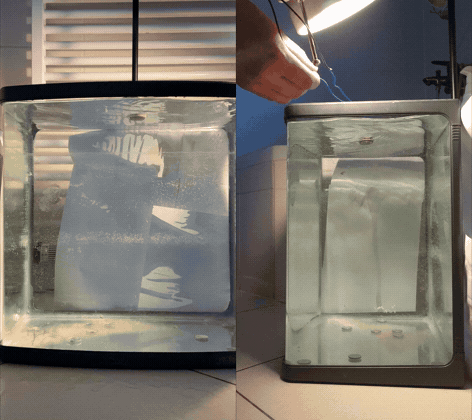
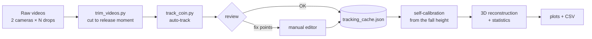
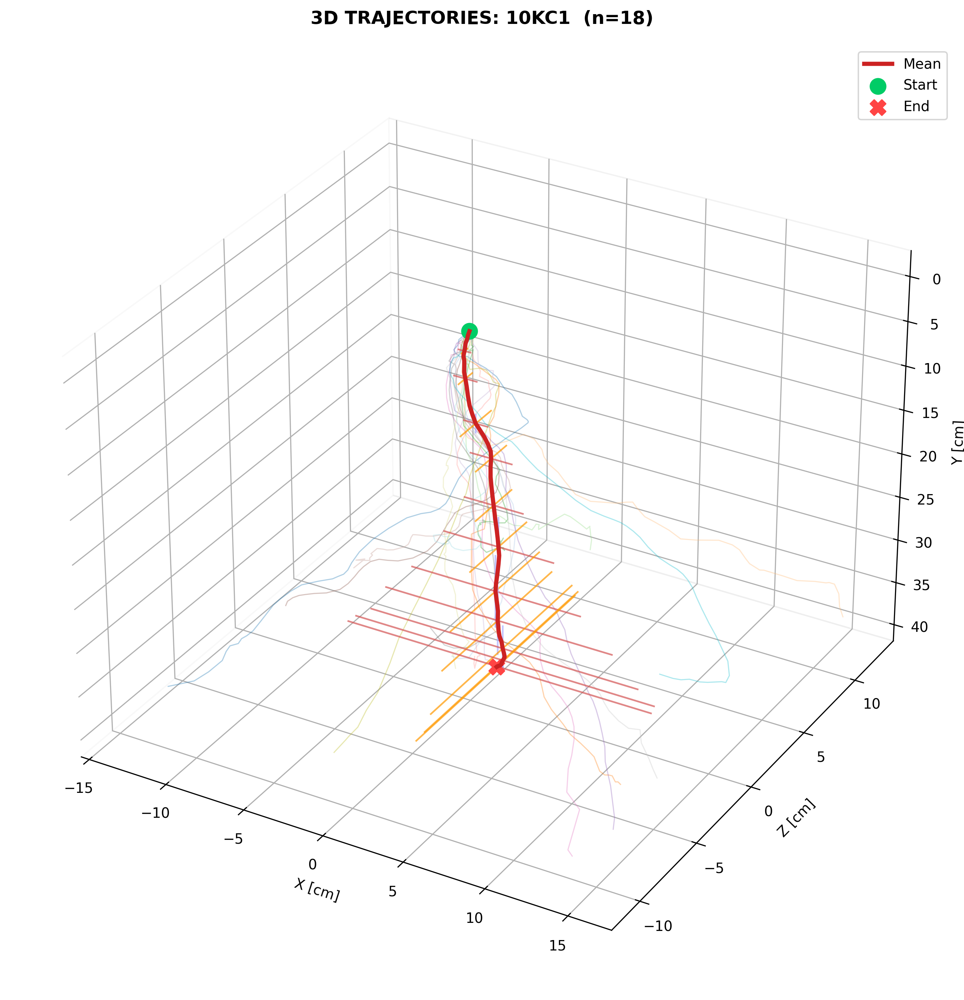
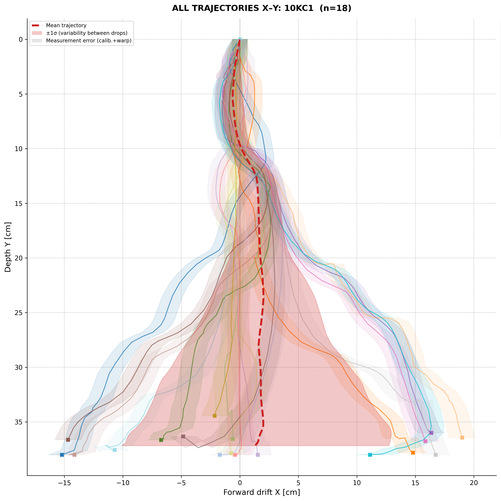
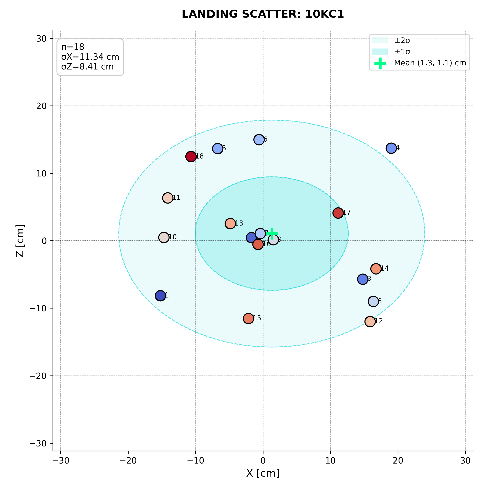
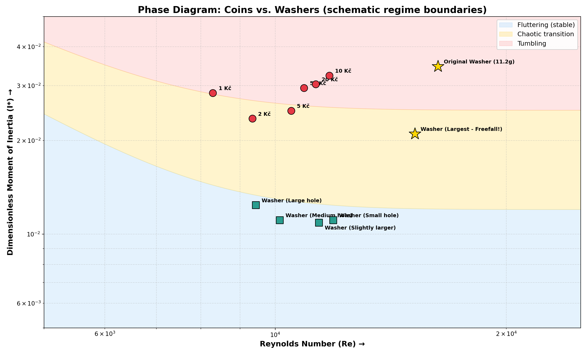
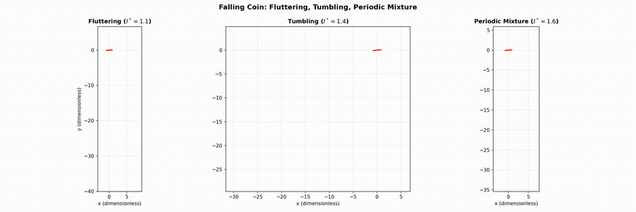

# Autumn Coin: 3D tracking of coins falling through water

<p align="center">
  
</p>

Drop a coin into water and it almost never falls straight down. It glides sideways, wobbles, flips over and
lands somewhere different every time. This repository holds the experiment and the analysis pipeline that
measure this motion in 3D. The project was a solution to problem 12 of the
**Czech Young Physicists' Tournament (TMF)**, the national round of the IYPT.

> **12. Autumn coin**
> The motion of a coin falling to the bottom of a tank filled with liquid can be remarkably similar to the
> fluttering and tumbling of a falling autumn leaf. Investigate how the motion of the coin depends on relevant
> parameters.

- **143 tracked drops**: 6 Czech coins (1, 2, 5, 10, 20 and 50 CZK) and washers with different central holes
- **Stereo reconstruction** from two phones filming the tank from perpendicular directions
- **Semi-automatic computer-vision tracker** (OpenCV): motion detection, frame differencing, then a manual review and correction editor
- **Statistics over repeated drops**: mean 3D trajectory, ±1σ spread, landing scatter and an energy budget
- **Numerical model** of a falling plate (a quasi-steady ODE model) that reproduces fluttering and tumbling

## Experiment

An electromagnet releases the coin at the water surface, so every drop starts from the same position and
orientation. The water tank is 38 × 32 × 38 cm. Two iPhones (15 Pro and 11) record each drop simultaneously:

| Camera 1 (front) | Camera 2 (side) |
| --- | --- |
| horizontal drift **X** and depth **Y** | horizontal drift **Z** and depth **Y** |

| Coin | Mass | Diameter | Drops |
| --- | --- | --- | --- |
| 1 CZK | 3.6 g | 20.0 mm | 15 |
| 2 CZK | 3.7 g | 21.5 mm | 19 |
| 5 CZK | 4.8 g | 23.0 mm | 18 |
| 10 CZK | 7.62 g | 24.5 mm | 18 |
| 20 CZK | 8.42 g | 26.0 mm | 17 |
| 50 CZK | 9.7 g | 27.5 mm | 16 |

There were also 20 drops of each of two washers, one with a small and one with a large central hole. The motion
is close to chaotic, so a single trajectory says little and the analysis works on the whole ensemble.

## Pipeline



1. **Trimming** (`tracking/trim_videos.py`): step through each recording frame by frame and cut it at the release.
   Uses `ffmpeg` for a lossless cut and falls back to OpenCV if `ffmpeg` is missing.
2. **Tracking** (`tracking/track_coin.py`):
   - *Lock-on*: wait for motion in a narrow band just below the surface, under the electromagnet. Waves at the
     surface never trigger the lock this way.
   - *Follow*: frame differencing inside a local search window that moves with the coin. A max-jump limit and
     a "must keep sinking" rule reject reflections and splashes.
   - *Review*: replay the detected path over the video, then accept it, fix individual points in the editor or
     re-click the whole drop by hand.
   - Every accepted track is cached, so the analysis can be re-run without touching the videos.
3. **Self-calibration**: every coin falls through the same 38 cm of water, so the vertical distance it covers in
   pixels gives the scale of that camera for that drop. Phones were moved between recording days, and this handles
   it without any calibration target. It also partly accounts for perspective: a coin that lands closer to the
   camera covers more pixels. Drops whose track was lost before the bottom use the median scale of their set.
4. **3D reconstruction and statistics**: the two views are time-synchronised by detecting the onset of the steady
   fall in each camera and interpolated onto a common time axis. Velocities come from a Savitzky–Golay filter.
   The script then averages all drops of one object into a mean trajectory with ±1σ bands, plots the landing
   scatter and computes the potential, kinetic and dissipated energy.

## Results

<table>
  <tr>
    <td></td>
    <td></td>
  </tr>
  <tr>
    <td align="center"><em>18 drops of a 10 CZK coin in 3D, with the mean trajectory and ±1σ crosses</em></td>
    <td align="center"><em>The same drops seen by the front camera</em></td>
  </tr>
</table>

<p align="center">
  
</p>

Each object has a full set of plots and a CSV with the mean trajectory and individual landing points in
[`results/`](results/).

| Object | Drops | σ landing X [cm] | σ landing Z [cm] | Median landing distance [cm] |
| --- | ---: | ---: | ---: | ---: |
| 1 CZK | 15 | 12.9 | 9.3 | 15.9 |
| 2 CZK | 19 | 12.7 | 8.3 | 16.4 |
| 5 CZK | 18 | 12.5 | 8.7 | 16.1 |
| 10 CZK | 18 | 11.3 | 8.4 | 15.1 |
| 20 CZK | 17 | 11.9 | 5.1 | 12.0 |
| 50 CZK | 16 | 10.7 | 9.8 | 14.3 |
| Washer, small hole | 20 | 11.3 | 8.5 | 13.0 |
| Washer, large hole | 20 | 3.9 | 4.0 | 6.4 |

Landing distance is measured horizontally from the release point. The tank is only ±19 cm (X) by ±16 cm (Z) around
the release point, so many coins glide all the way to a wall. The spread of the coins is therefore partly limited
by the tank itself. The washer with the large hole is clearly the most stable.

### Accuracy

The tracker checks its own calibration: no coin can land outside the tank. Most drops land inside, but a few
come out 1–3 cm beyond a side wall. That points to a residual systematic error of about 10 % at the edges of the
tank. It comes from perspective and refraction (the coin is first seen a few cm below the surface, and the tank
bottom is viewed at an angle), which the single-scale calibration cannot fully remove. A full camera model, using
the depth measured by the other camera, would fix it.

### Coins vs. washers

<p align="center">
  
</p>

The falling regime of a thin disk is governed mainly by the Reynolds number *Re* and the dimensionless moment of
inertia *I\**. Coins sit in the tumbling and chaotic part of the diagram. Cutting a hole in the middle (washers)
pushes *I\** down into the fluttering regime. The shaded regime boundaries are schematic.

## Simulation

<p align="center">
  
</p>

`simulation/falling_coin_ode.py` integrates a 2D quasi-steady model of a plate falling through a fluid. The model
includes circulation-based lift, drag that depends on the angle of attack and a dissipative torque (after
Andersen, Pesavento & Wang, *J. Fluid Mech.* 2005). Changing the moment of inertia switches the motion between
fluttering, tumbling and a periodic mixture of the two.

## Repository structure

```
tracking/
  track_coin.py         main tracker: auto-tracking, review/editor, 3D reconstruction, plots
  calibrate.py          manual pixel → metre calibration from the tank height (for measure_velocity.py)
  trim_videos.py        cut recordings to the moment of release
  measure_velocity.py   click two frames, get the terminal velocity
simulation/
  falling_coin_ode.py   quasi-steady falling-plate model + animation
analysis/
  phase_diagram.py      Re vs I* diagram for coins and washers
  angular_velocity.py   angular velocity from two tracked points on the coin rim
data/
  <object>/tracking_cache.json   tracked pixel positions for every drop and camera
  sample_videos/                 two example drops (both cameras) to try the tracker on
results/
  <object>/             plots + CSV for every object
media/                  animations used in this README
docs/                   tournament presentation (PDF)
```

## Running it

```bash
pip install -r requirements.txt

# Re-create all plots for one object from the tracked data (no videos needed)
python tracking/track_coin.py data/coin_10czk

# Try the interactive tracker on the sample videos (OpenCV windows + terminal prompts)
python tracking/track_coin.py data/sample_videos

# Run the falling-plate simulation (saving the MP4 needs ffmpeg)
python simulation/falling_coin_ode.py
```

Results go to `results/<dataset name>/` by default. Use `-o <folder>` to change that.

### Data format

`tracking_cache.json` maps `<drop>_cam1` / `<drop>_cam2` to a pair of lists `[x_px, y_px]` with one value per
video frame. `x` is measured from the centre of the frame, `y` from the top, and `null` means the coin was not
visible in that frame. The full set of raw recordings (409 videos, ~1.5 GB) is not part of the repository.
Recordings of washers with medium-sized holes were also made but not tracked.

## Presentation

The slides presented at the tournament are in [`docs/autumn_coin_presentation.pdf`](docs/autumn_coin_presentation.pdf).
The 20 CZK slides (26–28) were updated after the tournament. An extra processing step had stretched the
side-camera data for that coin, so the plots now show the unmodified measurement. Since the tournament, the
calibration has also been reworked (see [Accuracy](#accuracy)), so the plots in [`results/`](results/) are more
accurate than the ones in the slides.

## Team

Team **Olomoucké srnky**, Gymnázium Olomouc-Hejčín: Vojtěch Přibyl, Michael Ambros and Ondřej Novotný.
The experiment, the measurements and all the tracking and analysis code in this repository are the work of
Ondřej Novotný.

Thanks to Marek Fürst (MFF UK), the consultant for this problem, for his introductory lecture on it.

See also my solution to TMF problem 3, [Ring fountain](https://github.com/ondrej-cloud/ring-fountain):
how high a falling washer can make water jump, with measurements and a momentum-transfer model.

## References

- A. Andersen, U. Pesavento, Z. J. Wang, *Analysis of transitions between fluttering, tumbling and steady descent of
  falling cards*, J. Fluid Mech. **541** (2005).
- U. Pesavento, *Unsteady aerodynamics of falling plates*, PhD thesis, Cornell University (2006).
- N. M. Kamaruddin, *Dynamics and performance of flying discs*, PhD thesis, University of Manchester (2011).
- M. Pazout, *Falling leaves simulation*, Master's thesis, CTU in Prague (2022).

## License

[MIT](LICENSE) © Ondřej Novotný
